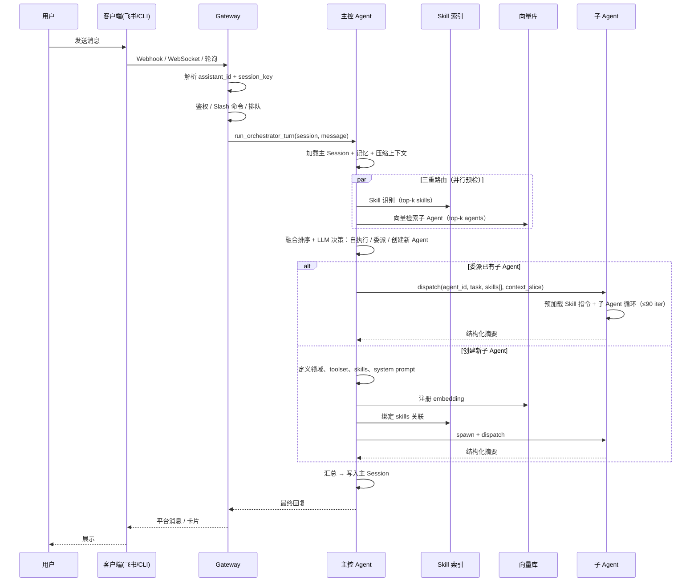

# Evolux 系统架构文档

> 版本：v0.1（架构设计阶段）  
> 受众：架构师、核心开发者  
> 参考基线：[Hermes Agent](https://github.com/NousResearch/hermes-agent) 架构，在其上针对「主控协调 + 领域子 Agent」模型优化

---

## 通俗版（先读这段）

Evolux 是一个**自托管、可进化**的多 Agent 系统。用户从飞书、CLI 等入口发消息，Gateway 接单后交给**主控 Agent**——它负责理解意图、选对专家、协调分工；真正干活的由**子 Agent**（领域专家）完成。

和 Hermes 最大的区别：

| 维度 | Hermes Agent | Evolux |
|------|--------------|--------|
| 对话主体 | 单一 Agent + 按需 `delegate_task` | **持久主控 Agent** + **领域子 Agent 池** |
| 子 Agent | 临时委派，无独立领域身份 | 可识别、可创建、可复用的**领域专家** |
| 路由 | 模型自行决定是否 delegate | **Skill 识别 + 向量检索 + 主控推理** 三重路由 |
| 多助手 | Profile 级隔离（`-p`） | **同一平台多助手**，互不打扰 |
| 迭代上限 | 默认 90 次 | 主控 **30 次** / 子 Agent **90 次**（均可配置） |

记住一张图：

```
用户 → 客户端(飞书/CLI/…) → Gateway → 主控 Agent（协调、记忆、三重路由）
                                           ↓
                              Skill识别 + 向量检索 + 主控推理
                                           ↓
                                    子 Agent 池（预加载 Skill 指令，真正执行）
```

---

## 1. 系统概述

### 1.1 产品定位

**Evolux** 是一个可自托管的 **多 Agent 协作运行时**。它将「与用户对话的主控 Agent」与「按领域分工的子 Agent」分离，通过 Gateway 接入多种客户端，使专业的事由专业 Agent 干，主控 Agent 负责协调、记忆与进化。

### 1.2 设计目标

| 目标 | 实现方式 |
|------|----------|
| **职责分离** | 主控 Agent 协调；子 Agent 单一领域、深度执行 |
| **智能路由** | Skill 识别 + 向量检索子 Agent + 主控 LLM 推理；未命中则动态创建 |
| **长对话可持续** | 主 Session 持久；上下文压缩（最近 10 轮优先 + 历史摘要 + 丢弃） |
| **多入口统一** | Gateway 适配 Hermes 级平台能力（飞书、Telegram、CLI 等） |
| **多助手隔离** | 同一平台可配置多个助手，Session / 记忆 / 子 Agent 作用域独立 |
| **可扩展** | 工具自注册、MCP、Skills、插件，继承 Hermes 扩展模型 |
| **成本可控** | 主控 30 / 子 Agent 90 迭代上限（可配置）、上下文压缩、Prompt 前缀缓存 |

### 1.3 非目标（边界）

- **不是** 通用 DAG 工作流引擎（复杂编排由主控 Agent 在单轮内协调）
- **不是** 多租户 SaaS（单进程 Gateway + 线程池，适合自托管/小团队）
- **子 Agent 默认非持久后台进程**（按需 spawn，结果回传主控；Cron 负责定时任务）
- **v0.1 不实现** Kanban 式任务看板、MOA 多模型投票（可后续扩展）

### 1.4 代码原则

Evolux 在 Hermes 代码基座上演进，实现阶段统一遵循以下原则。**写代码前先读 surrounding code，新增代码应像同一作者所写。**

#### 简单（Simplicity）

| 原则 | 要求 |
|------|------|
| **最小 diff** | 只改完成任务所需的代码，不顺手重构无关模块 |
| **YAGNI** | 不为「以后可能用到」预建抽象层、工厂、策略模式 |
| **直线路径** | 优先 flat 结构；嵌套超过 3 层应重新审视是否过度设计 |
| **单一职责** | 一个函数 / 一个类只做一件事；主控与子 Agent 逻辑不混写 |
| **配置优于硬编码** | 迭代上限、路由权重、压缩阈值等走 `config.yaml`，代码里只保留合理默认值 |

```python
# ✅ 简单：职责清晰
def identify_skills(message: str, top_k: int = 5) -> list[SkillCandidate]:
    ...

# ❌ 过度：为一次调用搭框架
class SkillIdentificationPipelineFactoryBuilder:
    ...
```

#### 可扩展、可控（Extensible & Controllable）

| 原则 | 要求 |
|------|------|
| **扩展点显式** | 工具 / 平台 / 向量后端 / 记忆插件通过 registry 或 ABC 注册，不散落 `if/else` |
| **行为可配置** | 路由权重、迭代预算、toolset 绑定均可通过配置关闭或覆盖，无需改代码 |
| **边界清晰** | Gateway 不碰 Agent 循环；Skill Router 不碰 SessionDB；模块间通过窄接口通信 |
| **继承 Hermes 扩展模型** | 复用 `tools/registry.py`、MCP 懒加载、Skills 渐进式披露，不另起炉灶 |
| **可控失败** | 向量检索 / Skill 识别失败时降级（BM25-only / 空候选），不阻断主控 turn |

```
扩展新平台  →  gateway/platforms/  + platform_registry.register()
扩展新工具  →  tools/*.py 自注册 + toolset 声明
扩展向量后端 →  vector/store.py 实现 VectorStore ABC
扩展 Skill   →  ~/.evolux/skills/  + 自动 reindex
```

#### 优雅（Elegance）

| 原则 | 要求 |
|------|------|
| **一致抽象** | 主 / 子 Agent 共享 `conversation_loop`，差异只在 toolset 与迭代预算 |
| **命名即文档** | `run_orchestrator_turn`、`fuse_routing`、`SkillCandidate` — 读名知意 |
| **拒绝聪明代码** | 不用晦涩元编程、隐式魔法；显式优于隐式 |
| **对称设计** | 创建 / 检索 / 退役子 Agent 走同一 AgentRegistry；Skill 安装 / 索引 / 识别走同一 SkillRouter |
| **依赖方向单一** | `agent/` → `tools/`、`vector/`；`gateway/` → `agent/`；底层不 import 上层 |

#### 可读性（Readability）

| 原则 | 要求 |
|------|------|
| **短函数** | 单函数建议 ≤ 50 行；超长循环体拆成命名良好的私有函数 |
| **类型标注** | 公共 API、dataclass、配置 schema 必须有 type hints |
| **早返回** | 减少深层 `if/else` 嵌套；错误路径先 return / raise |
| **常量集中** | 默认值、blocked tools、fusion 权重命名常量或 config dataclass，不散落 magic number |
| **中文日志，英文代码** | 变量 / 函数 / 类名用英文；面向用户的日志与文档用中文 |

```python
# ✅ 可读
@dataclass
class RoutingContext:
    skill_candidates: list[SkillCandidate]
    subagent_candidates: list[SubAgentCandidate]
    fused_ranking: list[FusedCandidate]

def fuse_routing(
    skills: list[SkillCandidate],
    agents: list[SubAgentCandidate],
    weights: FusionWeights,
) -> RoutingContext:
    ...

# ❌ 难读
def fr(s, a, w):
    return {"s": s, "a": a, "r": sorted(...)}
```

#### 注释（Comments）

**好代码 mostly 自解释；注释解释「为什么」，不解释「做了什么」。**

| 写注释 | 不写注释 |
|--------|----------|
| 非显而易见的业务规则（如 fusion 权重含义、为何不硬路由） | 逐行翻译代码 |
| 与 Hermes 的行为差异及原因 | 函数名已说明的内容 |
| 性能 / 并发 / 安全权衡 | `# increment i` 类废话 |
| 临时 workaround 附 TODO 与 issue | 过时注释（改代码必须同步改注释） |

```python
# ✅ 有价值的注释
# Sub-agents must not inherit the full main session history —
# only the orchestrator-injected task slice, to keep prefix cache stable
# and prevent sub-agent tool noise from polluting the user-facing session.

# ❌ 无价值
# Loop through candidates
for candidate in candidates:
    ...
```

**模块级 docstring：** 每个 `agent/`、`gateway/`、`vector/` 下的核心模块文件顶部用 3–5 行说明职责与上下游依赖。

**禁止：** 大段注释掉的代码提交到主分支；调试 print 改用 `logging`。

#### 原则优先级（冲突时）

```
简单 > 优雅 > 可扩展 > 可读性细节
```

- 不为「可扩展」引入当前用不到的接口层
- 可扩展与简单冲突时：做一个正确实现 + 一个清晰扩展点，而非一套完整框架
- 注释不能替代糟糕命名；先改善命名，再考虑加注释

### 1.5 开发模式：测试驱动 + 通过后提交

实现阶段采用 **TDD（Test-Driven Development）** 与 **小步提交** 相结合。每个 case 绿灯后再 push GitHub，保证主干始终可测、可追溯。

#### 开发模式（Dev Loop）

```
需求 / Phase 任务
    ↓
① 写 failing test（Red）
    ↓
② 写最少实现（Green）
    ↓
③ 重构，保持绿灯（Refactor）
    ↓
④ pytest 全量通过
    ↓
⑤ git commit → git push origin
```

**本地环境：**

```bash
cd evolux
python -m venv .venv && source .venv/bin/activate
pip install -e ".[dev]"          # Phase 1 起提供 pyproject.toml
pytest                           # 跑全量测试
pytest test/agent/test_foo.py -k "case_name" -v   # 单 case 调试
```

**目录约定：**

```
test/
├── agent/           # 主/子 Agent、路由、压缩
├── gateway/         # Session、assistant 路由
├── vector/          # Skill / SubAgent 索引
├── tools/           # orchestrator_tools 等
└── conftest.py      # 共享 fixture（临时 EVOLUX_HOME、mock LLM）
```

**测试分层：**

| 层级 | 范围 | 外部依赖 | 速度 |
|------|------|----------|------|
| **Unit** | 纯函数、dataclass、registry | 无；LLM / embedding mock | 毫秒级 |
| **Integration** | SessionDB、AgentRegistry、向量索引 | 临时目录 / sqlite | 秒级 |
| **E2E** | CLI 一条命令、Gateway 单轮（Phase 3+） | 可选 mock 平台 | 慢，少量 |

**Mock 原则：**

- 单元测试 **不调用** 真实 LLM API、不依赖网络
- 用 fixture 注入 fake `llm_call` / `embedder`，验证路由逻辑与数据结构
- 集成测试可用 `tmp_path` 隔离 `EVOLUX_HOME`

#### 测试驱动（TDD）

| 规则 | 说明 |
|------|------|
| **先测后码** | 新功能先加 `test_*.py`，看到 Red 再写实现 |
| **一 case 一行为** | 每个 test 函数只断言一个行为；命名 `test_<模块>_<场景>_<期望>` |
| **Phase 对齐** | Phase 1 的每个 checklist 项先有对应 test，再写生产代码 |
| **回归必保** | 修 bug 先写复现 test，再修代码 |
| **不跳过** | 禁止 `@pytest.mark.skip` 长期挂起；完不成的 case 不合并 |
| **覆盖率非 KPI** | 优先覆盖路由、Session、Registry 等核心路径，不追求 100% |

**示例（Phase 2 融合排序）：**

```python
# test/agent/test_routing.py — 先写
def test_fuse_routing_boosts_agent_with_matching_skills():
    skills = [SkillCandidate("git", score=0.9)]
    agents = [
        SubAgentCandidate("code-expert", skills=["git", "docker"], vector_score=0.6),
        SubAgentCandidate("feishu-expert", skills=["feishu-doc"], vector_score=0.8),
    ]
    result = fuse_routing(skills, agents, FusionWeights())
    assert result.fused_ranking[0].agent_id == "code-expert"
```

```python
# agent/routing.py — 后写，直到 test 通过
def fuse_routing(...) -> RoutingContext:
    ...
```

#### Case 通过后主动提交 GitHub

**每个可交付单元**（一个函数、一个模块、一个 Phase 子项）在 **pytest 全绿** 后立即 commit 并 push，不积压本地改动。

**提交前检查：**

```bash
pytest                    # 必须全部通过
git status                # 无多余临时文件
git diff                  # 确认 diff 范围符合「最小 diff」原则
```

**Commit 规范：**

```
<type>(<scope>): <简短说明>

<可选正文：为什么这样改>
```

| type | 用途 |
|------|------|
| `test` | 新增或修改测试（Red 阶段可单独 commit） |
| `feat` | 新功能（Green 后 commit） |
| `fix` | bug 修复 |
| `refactor` | 重构，行为不变 |
| `docs` | 文档 |

**示例：**

```
test(routing): add fuse_routing skill overlap cases

feat(routing): implement fuse_routing with configurable weights

fix(session): resolve assistant_id missing in session_key
```

**Push 策略：**

| 场景 | 动作 |
|------|------|
| 日常开发 | 功能分支 `feat/<name>`，case 通过后 **commit + push** 到 origin |
| Phase 完成 | 开 PR 合并 `main`；PR 描述附 `pytest` 通过截图或 CI 链接 |
| 仅文档 | `docs:` commit，无测试要求 |
| 仅测试（Red） | 允许单独 push `test:` commit，标注 WIP，随后 `feat:` 补实现 |

**远程仓库：** `origin` → `github.com/luyou-2023/evolux`

**禁止：**

- 测试失败时 push
- 一个 commit 混多个无关 Phase 项
- `--no-verify` 跳过 hook（除非 hook 本身有问题且已记录 issue）

#### Phase 与 TDD 映射

每个 Phase checklist 项按 **test → impl → commit** 推进，例如 Phase 1：

| 任务 | 先写 test | 通过后 commit 示例 |
|------|-----------|-------------------|
| AgentRegistry | `test_agent_registry_crud` | `feat(registry): add JSON agent registry` |
| Orchestrator 循环 | `test_orchestrator_max_iterations_30` | `feat(agent): orchestrator loop with iteration budget` |
| SubAgent 循环 | `test_subagent_max_iterations_90` | `feat(agent): subagent loop default 90 iterations` |

#### CI（后续）

Phase 1 末尾添加 GitHub Actions：push / PR 时自动 `pytest`，与本地门禁一致。

---

## 2. 逻辑架构总览

```
┌─────────────────────────────────────────────────────────────────────────────┐
│                           用户 / 外部系统入口                                 │
├──────────┬──────────┬──────────┬──────────┬──────────┬─────────────────────┤
│ CLI      │ 飞书     │ Telegram │ TUI      │ Web      │ 更多平台（插件）      │
│          │ (QR/配置)│          │          │ Dashboard│                      │
└────┬─────┴────┬─────┴────┬─────┴────┬─────┴────┬─────┴──────────┬──────────┘
     │          │          │          │          │                │
     ▼          ▼          ▼          ▼          ▼                ▼
┌─────────────────────────────────────────────────────────────────────────────┐
│  Gateway 层（asyncio）                                                        │
│  - 平台适配器、鉴权、Slash 命令、多助手路由                                    │
│  - Session 解析（assistant_id + platform + chat 拓扑）                       │
│  - 线程池桥接同步 Agent 循环                                                   │
└────────────────────────────────┬────────────────────────────────────────────┘
                                 │
                                 ▼
┌─────────────────────────────────────────────────────────────────────────────┐
│  主控 Agent（Orchestrator Agent）                                             │
│  max_iterations: 30（可配置）                                                 │
│  ┌─────────────────────────────────────────────────────────────────────┐   │
│  │ 主 Session（与用户持续对话，永久保存）                                  │   │
│  │ 记忆 · 工具 · MCP · Skills · 向量库 · 上下文压缩                      │   │
│  │ 职责：理解意图 → Skill识别/向量检索/推理 → 识别/创建子 Agent → 协调  │   │
│  └─────────────────────────────────────────────────────────────────────┘   │
└────────────────────────────────┬────────────────────────────────────────────┘
                                 │ dispatch / create
                                 ▼
┌─────────────────────────────────────────────────────────────────────────────┐
│  子 Agent 池（Domain Expert Agents）                                          │
│  max_iterations: 90（可配置，每个子 Agent 独立）                               │
│  ┌──────────┐  ┌──────────┐  ┌──────────┐  ┌──────────┐                    │
│  │ 代码专家  │  │ 数据分析  │  │ 飞书文档  │  │ …动态创建 │                    │
│  └──────────┘  └──────────┘  └──────────┘  └──────────┘                    │
│  职责单一 · 领域专家 · 独立记忆/工具/MCP/Skills/上下文                         │
└────────────────────────────────┬────────────────────────────────────────────┘
                                 │
         ┌───────────────────────┼───────────────────────┐
         ▼                       ▼                       ▼
┌─────────────────┐   ┌─────────────────┐   ┌─────────────────────────────┐
│ 工具层           │   │ 向量库 + Skill索引│   │ 持久化                       │
│ tools/ registry │   │ 三重路由         │   │ SessionDB · AgentRegistry   │
│ MCP · Skills    │   │ 语义 + 能力匹配  │   │ ~/.evolux/                  │
└─────────────────┘   └─────────────────┘   └─────────────────────────────┘
```

---

## 3. 核心概念

### 3.1 主控 Agent（Orchestrator）

主控 Agent 是**唯一与用户直接对话**的 Agent。它持有**主 Session**，记录完整用户交互历史（经压缩后持久化）。

**核心职责：**

1. **意图理解** — 解析用户当前请求与主 Session 上下文
2. **三重路由识别** — Skill 识别 + 向量检索 + LLM 推理，判断应委派给哪个已有子 Agent（见 §4.4）
3. **子 Agent 创建** — 无匹配时，创建新的领域型子 Agent（可一次创建多个）
4. **协调编排** — 并行或串行调度子 Agent，合并结果
5. **用户回复** — 将子 Agent 产出整理为面向用户的最终回复

**能力边界：**

| 能力 | 主控 Agent | 说明 |
|------|-----------|------|
| 主 Session | ✅ | 与用户唯一对话通道 |
| 记忆（MEMORY/USER） | ✅ | 全局用户画像与跨领域笔记 |
| 工具 / MCP / Skills | ✅ | 协调类工具为主；重型执行委派子 Agent |
| 向量数据库 | ✅ | 检索子 Agent 注册表，非通用 RAG |
| 上下文压缩 | ✅ | 见 §5.3 |
| 直接执行复杂任务 | ⚠️ 有限 | 简单任务可自执行；复杂任务应委派 |

**迭代预算（主控）：** 默认 `max_iterations = 30`，环境变量 `EVOLUX_ORCHESTRATOR_MAX_ITERATIONS` 或 `config.yaml` 覆盖。主控侧重协调与路由，迭代上限低于子 Agent。

### 3.2 子 Agent（Domain Expert）

子 Agent 是**真正干活的执行单元**，职责单一、领域聚焦。

**核心特征：**

- **隔离上下文** — 不继承主 Session 全量历史；主控注入任务目标 + 必要摘要
- **独立迭代预算** — 默认 90 次，配置项 `EVOLUX_SUBAGENT_MAX_ITERATIONS`；子 Agent 承担实际执行，迭代上限高于主控
- **独立工具集** — 按领域绑定 toolset（如 `evolux-code`、`evolux-feishu-doc`）
- **独立记忆** — 领域级 `MEMORY.md`（如 `agents/code-expert/MEMORY.md`）
- **禁止递归** — 子 Agent 不可再 spawn 子 Agent（v0.1）
- **结果回传** — 仅向主控返回结构化摘要 + 关键产出，中间推理不污染主 Session

**生命周期：**

```
创建（主控识别/动态注册）
  → 注册到 AgentRegistry + 向量索引
  → 按需实例化（spawn）
  → 执行任务
  → 返回摘要
  → 实例销毁（注册信息保留，供下次路由）
```

**多子 Agent 并行：** 主控可在单轮内 dispatch 多个子 Agent（默认上限 3，可配置 `orchestrator.max_concurrent_subagents`）。

### 3.3 主 Session vs 子 Session

| 类型 | 标识 | 持久化 | 用途 |
|------|------|--------|------|
| **主 Session** | `orchestrator:<assistant_id>:<platform>:<chat_key>` | 永久（压缩链） | 用户对话、主控 Agent 历史 |
| **子 Session** | `subagent:<agent_id>:<task_id>` | 任务级（可选归档） | 单次委派执行上下文 |

主 Session 是产品核心资产；子 Session 为 ephemeral，完成后可压缩归档至 Agent 领域记忆。

---

## 4. 请求流（Client → Gateway → 主控 → 子 Agent）



### 4.1 Gateway 层（继承 Hermes 模式）

Gateway 保持 **asyncio 主循环 + 线程池执行同步 Agent**，避免阻塞平台 webhook。

**Session Key 格式（Evolux 扩展）：**

```
orchestrator:<assistant_id>:<platform>:<chat_type>:<chat_id>[:thread_id][:user_id]
```

- `assistant_id` — 多助手隔离键（见 §6）
- 其余字段与 Hermes `build_session_key()` 语义一致

**Gateway 职责：**

| 组件 | 职责 |
|------|------|
| `gateway/run.py` | 消息路由、主控 Agent 缓存、线程池桥接 |
| `gateway/session.py` | SessionStore、reset 策略、assistant 绑定 |
| `gateway/platforms/*.py` | 平台适配器（优先复用 Hermes 飞书实现） |
| `gateway/assistant_registry.py` | 多助手配置与路由（**新增**） |

**Agent 缓存：** 按 `session_key` 缓存主控 Agent 实例；配置签名变化时失效（模型、toolset、assistant 配置）。

### 4.2 主控 Agent 循环

伪代码：

```python
def run_orchestrator_turn(session, user_message):
    history = load_main_session(session)
    history = compress_if_needed(history)          # §5.3
    memory = prefetch_memory(session)

    # 三重路由预检（并行）
    skill_candidates = skill_router.identify(user_message, top_k=5)       # §4.4
    subagent_candidates = vector_search(user_message, top_k=5)
    routing_context = fuse_routing(skill_candidates, subagent_candidates)  # 交叉加权

    messages = build_messages(history, memory, routing_context, user_message)

    for i in range(max_iterations):                # default 30
        response = llm_call(messages, tools=orchestrator_tools)
        if not response.tool_calls:
            return response.content

        for tool_call in response.tool_calls:
            match tool_call.name:
                case "dispatch_subagent":
                    result = spawn_and_run_subagent(..., skills=routing_context.skills)
                case "create_subagent":
                    agent_def = define_domain_agent(..., skills=routing_context.skills)
                    register_to_vector_db(agent_def)
                    skill_router.bind_agent(agent_def)
                    result = spawn_and_run_subagent(agent_def, ...)
                case "search_subagents":
                    result = vector_search(...)
                case "identify_skills":
                    result = skill_router.identify(...)
                case _:
                    result = execute_tool(tool_call)

            messages.append(tool_result(result))

    return summarize_on_budget_exhausted(messages)
```

### 4.3 子 Agent 循环

与 Hermes `delegate_task` 类似，但子 Agent 有**持久身份**（`agent_id`、领域描述、向量 embedding），而非一次性 ephemeral worker。

```python
def run_subagent(agent_id, task, context_slice, toolsets, skills=None):
    agent_def = AgentRegistry.get(agent_id)
    skill_instructions = skill_router.load_for_execution(skills or agent_def.skills)
    messages = [
        system(agent_def.system_prompt + skill_instructions),
        user(format_task(task, context_slice)),
    ]
    for i in range(subagent_max_iterations):       # default 90
        response = llm_call(messages, tools=resolve_tools(toolsets))
        if not response.tool_calls:
            return format_subagent_result(response)
        messages.extend(execute_tools(response.tool_calls))
    return summarize_on_budget_exhausted(messages)
```

### 4.4 三重路由（Skill 识别 + 向量检索 + 主控推理）

主控 Agent 在每轮 turn 开始时执行**三重路由**，目标是在委派前尽可能精准地找到「谁来做、用什么 Skill 做」。

```
用户消息
    │
    ├─① Skill 识别 ──────────→ skill_candidates[]     （领域能力匹配）
    │
    ├─② 向量检索 ────────────→ subagent_candidates[]  （专家实体匹配）
    │
    ├─③ 融合排序 ────────────→ routing_context        （交叉加权）
    │
    └─④ 主控 LLM 推理 ───────→ 最终决策               （自执行 / 委派 / 创建）
```

#### ① Skill 识别（Skill Router）

**目的：** 从用户意图中识别需要哪些**领域能力/工作流**（Skill），而非直接选 Agent。Skill 是更细粒度的能力单元。

**输入：**

- 用户当前消息
- 主 Session 最近 N 轮摘要（可选）
- 助手级 Skill 白名单（`assistant.skills_allowlist`）

**识别方式（两层，由快到慢）：**

| 层级 | 方法 | 成本 | 说明 |
|------|------|------|------|
| L1 元数据匹配 | 关键词 + BM25 / FTS | 极低 | 对 Skill `name` + `description`（≤1024 字符）做轻量检索 |
| L2 语义匹配 | Skill embedding 向量检索 | 低 | 对 `~/.evolux/skills/` 全量索引；top-k |

**输出：** `skill_candidates[]`

```json
{
  "skill_name": "feishu-doc",
  "score": 0.87,
  "match_source": "vector",
  "description": "飞书文档读写与协作"
}
```

**渐进式披露（继承 Hermes）：**

- 路由阶段只使用 Skill **元数据**（name + description），不加载全文
- 委派后由子 Agent 通过 `skill_view` 加载完整 `SKILL.md` 指令

#### ② 向量检索（Sub-Agent Vector Search）

**目的：** 从 AgentRegistry 中找到语义最接近的**已有子 Agent 实体**。

**输入：** 用户消息 embedding  
**过滤：** `assistant_id`、未退役  
**输出：** `subagent_candidates[]`（含 `agent_id`、`domain`、`skills[]`、`score`）

与 §5.2 一致；此处强调它是三重路由的**第二路信号**，单独不足以硬路由。

#### ③ 融合排序（Fusion）

将 Skill 候选与子 Agent 候选**交叉加权**，生成统一的 `routing_context` 注入主控 system prompt：

```
final_score(agent) =
    α · vector_score(agent)
  + β · skill_overlap(agent.skills, skill_candidates)
  + γ · recency_boost(agent.last_used)
```

| 参数 | 默认值 | 说明 |
|------|--------|------|
| `α` | 0.5 | 向量语义权重 |
| `β` | 0.4 | Skill 重叠权重（核心：Skill→Agent 映射） |
| `γ` | 0.1 | 近期使用加权（同分时优先活跃 Agent） |

**Skill 重叠计算：**

- 子 Agent 注册时声明 `skills: [git, docker, python-dev]`
- `skill_overlap = |agent.skills ∩ skill_candidates| / |skill_candidates|`

**融合输出示例（注入主控 prompt）：**

```markdown
## 路由预检（系统自动生成，供协调决策参考）

### 识别到的 Skill（top-3）
1. feishu-doc (0.87) — 飞书文档读写
2. git (0.62) — Git 版本管理

### 候选子 Agent（融合排序 top-3）
1. feishu-doc-expert (0.91) — skills: [feishu-doc, feishu-drive]
2. code-expert (0.45) — skills: [git, python-dev]

### 路由建议
- 优先委派 feishu-doc-expert，预加载 skills: [feishu-doc]
- 若无合适 Agent，建议创建 domain=feishu 的子 Agent，绑定 skills: [feishu-doc]
```

#### ④ 主控 LLM 推理（最终决策）

融合结果**仅为建议**，最终决策权在主控 LLM：

| 决策 | 条件 | 动作 |
|------|------|------|
| **自执行** | 任务简单、无需领域深度 | 主控直接用 orchestrator toolset 完成 |
| **委派** | 融合分数 ≥ 阈值 且 LLM 确认 | `dispatch_subagent(agent_id, skills=[...])` |
| **创建** | 无合适 Agent 但 Skill 明确 | `create_subagent(domain, skills=[...])` |
| **多 Agent 并行** | 任务跨领域 | 分别 dispatch 多个子 Agent，各带不同 skills |

**关键约束：**

- Skill 识别与向量检索**均非硬路由**，避免误匹配直接委派
- 主控可在推理中调用 `identify_skills` / `search_subagents` 二次确认
- 子 Agent spawn 时**必须**携带路由阶段识别的 skills 列表，确保「专业的事专业的 Skill 干」

#### 路由时序

```
turn 开始
  → [并行] skill_router.identify() + vector_store.search()
  → fuse_routing() → 写入 routing_context
  → 主控 LLM 第一轮推理（已含 routing_context）
  → 决策 → dispatch / create / 自执行
  → 子 Agent 加载 skill_view(skills[]) → 执行
```

#### 新增模块

| 模块 | 职责 |
|------|------|
| `agent/skill_router.py` | Skill 索引、识别、与子 Agent 绑定 |
| `vector/skill_index.py` | Skill description embedding 索引 |
| `tools/orchestrator_tools.py` | 新增 `identify_skills` 工具 |

---

## 5. 记忆、上下文与向量库

### 5.1 记忆分层

```
~/.evolux/
├── memories/
│   ├── MEMORY.md              # 主控全局记忆
│   ├── USER.md                # 用户画像
│   └── agents/
│       └── <agent_id>/
│           └── MEMORY.md      # 子 Agent 领域记忆
├── agents/
│   └── registry.json          # 子 Agent 注册表（元数据）
└── vector/
    ├── subagents.db           # 子 Agent 语义索引
    └── skills.db              # Skill description 语义索引
```

| 层级 | 所有者 | 写入者 | 注入时机 |
|------|--------|--------|----------|
| USER.md | 用户 | 主控 | 主 Session 启动 |
| 主 MEMORY.md | 主控 | 主控 | 主 Session 启动（冻结快照） |
| 子 Agent MEMORY.md | 子 Agent | 子 Agent | 子 Agent spawn 时 |
| 子 Agent 向量索引 | 系统 | 创建/更新子 Agent 时 | 三重路由 §4.4 ② |
| Skill 向量索引 | 系统 | Skill 安装/更新时 | 三重路由 §4.4 ① |

**设计原则（继承 Hermes）：** 主 Session 启动时将 MEMORY/USER 作为**冻结快照**注入 system prompt，保证前缀缓存稳定；中途写入持久化但不 bust 当前 turn 的 prefix cache。

### 5.2 向量数据库

向量库服务于三重路由中的 **② 子 Agent 检索** 与 **① Skill 语义检索**，不是通用文档 RAG。

#### 5.2.1 子 Agent 索引

**用途：** 子 Agent 实体语义匹配（三重路由第二路）。

**索引字段：**

| 字段 | 说明 |
|------|------|
| `agent_id` | 唯一标识 |
| `name` | 可读名称（如「Python 代码专家」） |
| `domain` | 领域标签（code / data / feishu / …） |
| `description` | 能力描述（embedding 主文本） |
| `skills` | 绑定 Skill 列表（用于融合排序 §4.4 ③） |
| `toolsets` | 绑定工具集 |
| `assistant_id` | 所属助手（多助手隔离） |
| `embedding` | 描述向量 |

**检索流程：**

1. 用户消息 → embedding
2. 过滤 `assistant_id`（同助手内检索）
3. Top-k 候选 → 送入融合排序（非直接委派）

#### 5.2.2 Skill 索引

**用途：** Skill 能力语义匹配（三重路由第一路）。

**索引字段：**

| 字段 | 说明 |
|------|------|
| `skill_name` | Skill 唯一名（≤64 字符） |
| `description` | SKILL.md frontmatter 描述（≤1024 字符，embedding 主文本） |
| `domain_tags` | 可选领域标签（来自 metadata） |
| `assistant_id` | 助手级过滤（可选白名单） |
| `embedding` | 描述向量 |

**索引更新时机：**

- Skill 安装 / 更新 / 删除时自动重建
- `evolux skills install` 或手动修改 `SKILL.md` 后触发

**默认后端：** `sqlite-vec`（零依赖、嵌入式）；可配置切换 Chroma / Qdrant。子 Agent 与 Skill 可共用同一后端、不同 collection。

### 5.3 上下文压缩（主 Session）

**设计原则：注意力最近优先（Recency-first Attention）**

| 规则 | 参数 | 行为 |
|------|------|------|
| **保留最近 N 轮完整对话** | `compression.keep_recent_turns = 10` | 最近 10 轮 user/assistant 消息原样保留 |
| **历史摘要** | 启用 | 超出窗口的旧对话 → 辅助 LLM 生成结构化摘要 |
| **丢弃** | 启用 | 摘要完成后删除原始旧消息（不保留冗余） |
| **最新对话优先** | 启用 | 压缩触发时优先保留 tail；head（system + 摘要）固定 |

**摘要模板：**

```markdown
## 历史摘要（自动生成，非用户指令）
- 用户长期目标：…
- 已完成事项：…
- 进行中任务：…
- 关键决策与偏好：…
- 活跃子 Agent：…
```

**触发条件：**

- 预检：turn 开始前 token 数 > `compression.preflight_threshold`
- 中途：单次 turn 内 tool 循环后 token 数 > `compression.mid_turn_threshold`
- 手动：用户 `/compress`

**与 Hermes 差异：** Hermes 使用 head+tail token 预算；Evolux **显式按轮次（10 轮）** 保留完整对话，更适合多 Agent 协调场景下「最近委派上下文不可丢」的需求。

---

## 6. 客户端与多助手模型

### 6.1 客户端支持（对齐 Hermes）

| 客户端 | 配置方式 | 说明 |
|--------|----------|------|
| CLI | `evolux` | 本地终端，默认助手 |
| 飞书 / Lark | Webhook 或 WebSocket | 扫码 / 开放平台配置 |
| Telegram / Discord / … | 复用 Hermes 适配器 | 插件化扩展 |
| TUI | `evolux --tui` | Ink 双进程 |
| Web Dashboard | 配置助手、查看 Session | 后续阶段 |

**飞书配置示例（概念）：**

```yaml
assistants:
  work-bot:
    name: "工作助手"
    platforms:
      feishu:
        app_id: "${FEISHU_WORK_APP_ID}"
        app_secret: "${FEISHU_WORK_APP_SECRET}"
        mode: websocket
    default_subagents: ["code-expert", "feishu-doc"]
  life-bot:
    name: "生活助手"
    platforms:
      feishu:
        app_id: "${FEISHU_LIFE_APP_ID}"
        app_secret: "${FEISHU_LIFE_APP_SECRET}"
    default_subagents: ["general-assistant"]
```

### 6.2 多助手隔离

同一 Gateway 进程可挂载**多个助手**，每个助手拥有独立：

| 隔离域 | 键 |
|--------|-----|
| Session | `assistant_id` 前缀 |
| 主 Session 历史 | per assistant + chat |
| 主 MEMORY / USER | `~/.evolux/assistants/<assistant_id>/memories/` |
| 子 Agent 注册表 | 过滤 `assistant_id` |
| 向量索引 | 分 collection 或 metadata 过滤 |
| 工具 / MCP 配置 | per-assistant override |

**互不打扰保证：** 同一飞书用户给「工作助手」和「生活助手」发消息，Session Key 不同，记忆与子 Agent 池完全隔离。

### 6.3 客户端自配置（QR / 向导）

继承 Hermes _setup 向导模式，扩展助手维度：

```bash
evolux setup                    # 交互式向导
evolux assistant create         # 创建新助手
evolux assistant bind feishu    # 绑定飞书（展示 QR / 配置链接）
evolux gateway start            # 启动 Gateway
```

WhatsApp 类 QR 扫码流程可直接复用 Hermes `gateway/platforms/whatsapp` 模式；飞书走开放平台应用配置 + WebSocket 长连接。

---

## 7. 工具、MCP、Skills

### 7.1 工具系统（继承 Hermes registry 模式）

```
tools/registry.py
    ↑ self-register
tools/*.py
    ↑ discover
model_tools.py
    ↑ get_tool_definitions / handle_function_call
OrchestratorAgent / SubAgent
```

**主控专属工具（新增）：**

| 工具 | 说明 |
|------|------|
| `dispatch_subagent` | 委派任务给已有子 Agent（携带 skills 列表） |
| `create_subagent` | 定义并注册新领域子 Agent（绑定 skills） |
| `search_subagents` | 向量 + 关键词检索子 Agent |
| `identify_skills` | Skill 识别（三重路由第一路，可二次调用） |
| `list_subagents` | 列出当前助手下所有子 Agent |

**子 Agent 工具限制（继承 Hermes DELEGATE_BLOCKED 思路）：**

- 禁止：`dispatch_subagent`、`create_subagent`、`clarify`（无用户通道）
- 禁止：写主 MEMORY.md
- 允许：领域内全部 toolset 工具

### 7.2 Toolsets

```yaml
# 概念示例
toolsets:
  evolux-orchestrator:
    tools: [dispatch_subagent, create_subagent, search_subagents, identify_skills,
            memory, skills_list, skill_view, session_search, ...]
  evolux-code:
    tools: [terminal, file_read, file_write, execute_code, ...]
  evolux-feishu:
    tools: [feishu_doc, feishu_drive, feishu_message, ...]
```

平台级 preset：

```yaml
platform_toolsets:
  feishu: [evolux-orchestrator, evolux-feishu]
  cli: [evolux-orchestrator, evolux-code, evolux-terminal]
```

### 7.3 MCP

- 配置：`config.yaml → mcp_servers`
- **懒加载发现**（继承 Hermes，避免 Gateway 启动阻塞）
- 主控与子 Agent 可配置不同 MCP 子集
- 子 Agent 创建时可绑定领域 MCP（如数据库 MCP 给 data-expert）

### 7.4 Skills 与三重路由

Skills 在 Evolux 中承担**双重角色**：

| 角色 | 阶段 | 说明 |
|------|------|------|
| **路由信号** | 主控三重路由 ① | 识别用户意图需要哪些领域能力 |
| **执行指令** | 子 Agent spawn 后 | 通过 `skill_view` 加载完整工作流 |

**格式：** agentskills.io `SKILL.md`（继承 Hermes）

**渐进式披露（三层）：**

| 层级 | 内容 | 使用场景 |
|------|------|----------|
| L0 索引 | name + description | Skill 向量索引、system prompt 技能目录 |
| L1 识别 | top-k skill_candidates | 三重路由 §4.4 ① |
| L2 执行 | 完整 SKILL.md + references | 子 Agent 委派后 `skill_view` 加载 |

**与子 Agent 的关系：**

```
Skill（能力单元）          子 Agent（执行实体）
  git          ──┐
  docker       ──┼──→  code-expert（绑定 skills: [git, docker, python-dev]）
  python-dev   ──┘
  feishu-doc   ──────→  feishu-doc-expert（绑定 skills: [feishu-doc, feishu-drive]）
```

- 子 Agent 注册时声明 `skills: [...]`，供融合排序计算重叠度
- 创建新子 Agent 时，主控根据 Skill 识别结果自动绑定 skills
- 主控持全局 Skill 索引；子 Agent 只加载其绑定的 skills
- 用户 `/git` 类 slash 命令仍可强制加载 Skill（继承 Hermes），绕过路由

**Skill 索引维护：**

```bash
evolux skills install official/git     # 安装 → 自动更新 Skill 向量索引
evolux skills reindex                  # 手动重建索引
```

---

## 8. 持久化与数据模型

### 8.1 SessionDB（继承 Hermes SQLite + FTS5）

**文件：** `~/.evolux/state.db`

| 表 | 用途 |
|----|------|
| `sessions` | session_id, session_key, assistant_id, parent_session_id |
| `messages` | 消息历史（role, content, tool_calls, timestamp） |
| `messages_fts` | FTS5 全文检索 |
| `compression_log` | 压缩链审计 |

**压缩链：** 与 Hermes 相同，`parent_session_id` 链接压缩后会话；Gateway 加载时 walk 到 compression tip。

### 8.2 AgentRegistry

**文件：** `~/.evolux/agents/registry.json` + 向量库

```json
{
  "agent_id": "code-expert",
  "assistant_id": "work-bot",
  "name": "Python 代码专家",
  "domain": "code",
  "description": "擅长 Python 开发、调试、重构、代码审查",
  "system_prompt_template": "...",
  "toolsets": ["evolux-code"],
  "skills": ["git", "docker"],
  "mcp_servers": [],
  "created_at": "2026-06-13T00:00:00Z",
  "updated_at": "2026-06-13T00:00:00Z",
  "stats": { "invocations": 42, "last_used": "..." }
}
```

### 8.3 配置目录

```
~/.evolux/
├── config.yaml
├── .env
├── state.db
├── assistants/
│   └── <assistant_id>/
│       ├── config.yaml
│       └── memories/
├── agents/
│   └── registry.json
├── skills/
├── plugins/
├── vector/
└── logs/
```

**Profile 多实例：** `evolux -p <name>` → `EVOLUX_HOME=~/.evolux/profiles/<name>/`（与 Hermes 一致）。

---

## 9. 模块结构（规划）

```
evolux/
├── agent/
│   ├── orchestrator.py        # 主控 Agent 循环
│   ├── subagent.py            # 子 Agent 循环
│   ├── conversation_loop.py   # 共享 LLM ↔ 工具循环
│   ├── context_compressor.py  # 上下文压缩（10 轮策略）
│   ├── memory_manager.py      # 记忆管理
│   ├── agent_registry.py      # 子 Agent 注册表
│   ├── skill_router.py        # Skill 识别 + 与 Agent 绑定
│   └── iteration_budget.py    # 迭代预算
├── gateway/
│   ├── run.py                 # GatewayRunner
│   ├── session.py             # Session 管理
│   ├── assistant_registry.py  # 多助手路由
│   └── platforms/             # 平台适配器
├── tools/
│   ├── registry.py
│   ├── orchestrator_tools.py # dispatch/create/search subagent
│   └── ...                    # 继承 Hermes 工具
├── vector/
│   ├── store.py               # 向量库抽象
│   ├── skill_index.py         # Skill description 索引
│   └── embedder.py            # Embedding 客户端
├── mcp/
├── skills/
├── cli/
│   ├── main.py
│   ├── setup.py               # 配置向导
│   └── assistant.py           # 助手管理 CLI
├── acp/                       # IDE 集成
├── cron/                      # 定时任务
├── test/                      # pytest（TDD，镜像 agent/ gateway/ vector/ 结构）
│   └── conftest.py
├── .github/workflows/         # CI：push/PR 跑 pytest
├── run_agent.py               # EvoluxAgent 门面
└── evolux_state.py            # SessionDB
```

---

## 10. 配置参考

```yaml
# ~/.evolux/config.yaml

orchestrator:
  max_iterations: 30
  max_concurrent_subagents: 3
  model: "anthropic/claude-sonnet-4-20250514"

subagent:
  max_iterations: 90
  default_toolsets: ["evolux-code"]

compression:
  keep_recent_turns: 10
  preflight_threshold: 80000      # tokens
  mid_turn_threshold: 100000
  summary_model: "auxiliary"      # 廉价模型做摘要

vector:
  backend: "sqlite-vec"           # sqlite-vec | chroma | qdrant
  embedding_model: "openai/text-embedding-3-small"
  subagent_top_k: 5
  skill_top_k: 5

routing:
  fusion:
    vector_weight: 0.5            # α — 子 Agent 向量分
    skill_overlap_weight: 0.4     # β — Skill 重叠分
    recency_weight: 0.1           # γ — 近期使用分
  skill_identify:
    enable_bm25: true             # L1 元数据快速匹配
    enable_vector: true           # L2 语义匹配

memory:
  prefetch: true

mcp_servers:
  # ...

assistants:
  default:
    name: "默认助手"
    platforms:
      cli: {}
```

**环境变量：**

| 变量 | 说明 |
|------|------|
| `EVOLUX_HOME` | 数据目录 |
| `EVOLUX_ORCHESTRATOR_MAX_ITERATIONS` | 主控迭代上限（默认 30） |
| `EVOLUX_SUBAGENT_MAX_ITERATIONS` | 子 Agent 迭代上限（默认 90） |

---

## 11. 与 Hermes Agent 的关系

### 11.1 直接复用

| 模块 | 复用策略 |
|------|----------|
| `gateway/platforms/*` | 复制 + 改 session_key 前缀 |
| `tools/registry.py` | 直接复用 |
| `tools/*.py`（terminal, file, browser…） | 直接复用 |
| `hermes_state.py` → `evolux_state.py` | 适配 assistant_id 字段 |
| MCP 客户端 | 直接复用 |
| Skills 加载 | 直接复用 |
| 压缩辅助 LLM 调用 | 复用，改压缩策略参数 |

### 11.2 核心改造

| 模块 | 改造点 |
|------|--------|
| `run_agent.py` | 拆分 OrchestratorAgent / SubAgent |
| `conversation_loop.py` | 提取共享循环；主/子 Agent 不同 toolset |
| `delegate_tool.py` | 演进为 `orchestrator_tools.py` + 持久 AgentRegistry |
| `gateway/session.py` | 增加 `assistant_id` |
| 新增 `vector/` | 子 Agent + Skill 双索引 |
| 新增 `agent/skill_router.py` | Skill 识别与三重路由融合 |
| 新增 `agent/agent_registry.py` | 子 Agent CRUD |

### 11.3 架构对比图

```
Hermes:  User → Gateway → AIAgent ──delegate_task──→ ephemeral subagent
                              ↑
                         单 Session

Evolux:  User → Gateway → OrchestratorAgent ──dispatch──→ Domain SubAgent
                              ↑                              ↑
                         主 Session（永久）     AgentRegistry + SkillRouter + Vector
                                              （Skill识别 + 向量检索 + 主控推理）
```

---

## 12. 安全与鉴权

| 机制 | 说明 |
|------|------|
| DM Pairing | 继承 Hermes 配对码流程 |
| 多助手 Token 隔离 | 各助手独立 app token |
| 子 Agent 工具沙箱 | blocked tools 列表 + 可选 auto_deny |
| Webhook 签名验证 | 飞书 / 各平台 adapter 内置 |
| Session 级 ACL | Slash 命令权限控制 |

---

## 13. 可观测性

| 维度 | 实现 |
|------|------|
| 日志 | `~/.evolux/logs/orchestrator.log`, `subagent.log`, `gateway.log` |
| 主控 → 子 Agent 链路 | `task_id` + `agent_id` 贯穿日志 |
| 迭代消耗 | IterationBudget 计数，超限 summary |
| Gateway RPC | `orchestrator.status`, `subagent.list`, `assistant.list` |

---

## 14. 实施阶段

### Phase 1 — 核心运行时（MVP）

> 每项：**先写 test → 实现 → pytest 绿 → commit + push**

- [ ] `pyproject.toml` + pytest 脚手架 + `conftest.py`
- [ ] EvoluxAgent 门面 + 共享 conversation_loop
- [ ] OrchestratorAgent 循环（max 30）
- [ ] SubAgent 循环（max 90）
- [ ] AgentRegistry（JSON）
- [ ] 主 Session SessionDB
- [ ] CLI 入口
- [ ] GitHub Actions：`pytest` on push（Phase 1 收尾）

### Phase 2 — 三重路由与压缩

> 每项：**先写 test → 实现 → pytest 绿 → commit + push**

- [ ] Skill 索引 + `skill_router.identify()`
- [ ] 子 Agent 向量库 + embedding 检索
- [ ] 融合排序 `fuse_routing()`（Skill 重叠 + 向量 + 近期）
- [ ] 上下文压缩（10 轮 + 摘要 + 丢弃）
- [ ] orchestrator_tools（dispatch / create / search / identify_skills）
- [ ] 记忆分层

### Phase 3 — Gateway 与多助手

- [ ] Gateway 线程池桥接
- [ ] assistant_registry + 多助手 Session 隔离
- [ ] 飞书适配器
- [ ] setup 向导

### Phase 4 — 扩展与打磨

- [ ] 更多平台适配器
- [ ] MCP / Skills 领域绑定
- [ ] TUI / Web Dashboard
- [ ] Cron 定时任务

---

## 15. 待决事项（架构评审）

| # | 问题 | 倾向方案 |
|---|------|----------|
| 1 | 子 Agent 创建后是否允许主控合并/退役？ | 支持 `retire_subagent`，向量索引软删除 |
| 2 | 子 Agent 是否共享同一 model？ | 默认继承主控 model；注册表可 per-agent override |
| 3 | 向量库后端默认值 | sqlite-vec（简单）；生产可切 Qdrant |
| 4 | 子 Agent 执行结果是否存回主 Session 全文？ | 仅摘要 + 可选 artifact 引用 |
| 5 | 同一任务重复路由是否复用子 Session？ | 不复用；每次 dispatch 新 task_id |
| 6 | Skill 识别 L1/L2 是否都默认开启？ | 是；L1 BM25 快速过滤 + L2 向量精排 |
| 7 | 融合权重是否允许 per-assistant 覆盖？ | 是，在 `assistants.<id>.routing.fusion` 覆盖 |

---

## 附录 A：术语表

| 术语 | 定义 |
|------|------|
| 主控 Agent | Orchestrator，与用户对话并协调子 Agent |
| 子 Agent | Domain Expert，领域执行单元 |
| 主 Session | 用户与主控 Agent 的持久对话上下文 |
| assistant_id | 多助手隔离标识 |
| AgentRegistry | 子 Agent 元数据注册表 |
| Skill Router | Skill 识别与索引，三重路由第一路 |
| 三重路由 | Skill 识别 + 向量检索 + 主控 LLM 推理 |
| routing_context | 融合排序后的路由建议，注入主控 prompt |
| 注意力最近原则 | 上下文压缩优先保留最新 N 轮完整对话 |
| 代码原则 | 简单、可扩展可控、优雅、可读性、注释（§1.4） |
| TDD | 先写 test，Red → Green → Refactor（§1.5） |
| Dev Loop | case 通过后 commit + push GitHub（§1.5） |

## 附录 B：参考文档

- Hermes Agent 架构：`hermes-agent/docs/zh-CN/01-系统架构文档.md`
- Hermes 子 Agent 实现：`hermes-agent/tools/delegate_tool.py`
- Hermes Gateway：`hermes-agent/gateway/run.py`
